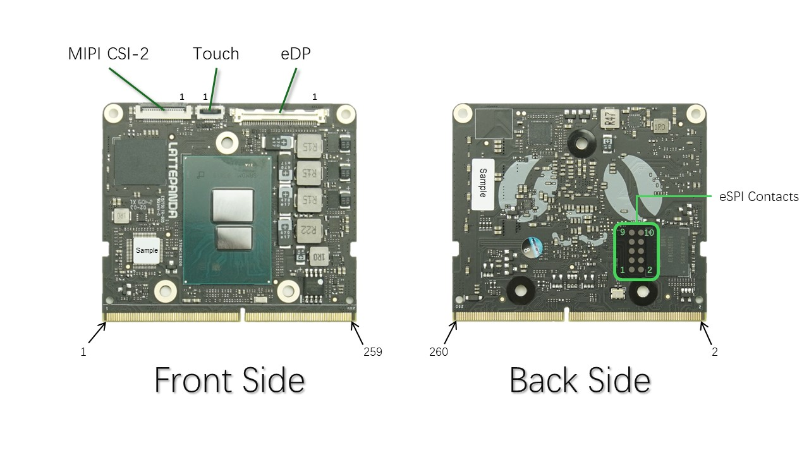

# 引脚定义

LattePanda Mu 全部引脚定义

⚠️ 注意:  
由于存在大量功能复用引脚，因此在开始设计前请先查看 [BIOS 功能文档](../../Softwares/BIOS/README.md)。请勿直接根据此处的引脚定义文档进行设计。

## eDP

I-PEX 20455-040E

| 编号 | 名称      | 类型 | 描述              |
|--------|-----------|:----:|--------------------------|
| 1      | NC        |      |                          |
| 2      | GND       |      |                          |
| 3      | DDIA_TX3- | O    | Lane 3 (-)               |
| 4      | DDIA_TX3+ | O    | Lane 3 (+)               |
| 5      | GND       |      |                          |
| 6      | DDIA_TX2- | O    | Lane 2 (-)               |
| 7      | DDIA_TX2+ | O    | Lane 2 (+)               |
| 8      | GND       |      |                          |
| 9      | DDIA_TX1- | O    | Lane 1 (-)               |
| 10     | DDIA_TX1+ | O    | Lane 1 (+)               |
| 11     | GND       |      |                          |
| 12     | DDIA_TX0- | O    | Lane 0 (-)               |
| 13     | DDIA_TX0+ | O    | Lane 0 (+)               |
| 14     | GND       |      |                          |
| 15     | DDIA_AUX+ | O    | Auxiliary channel (+)    |
| 16     | DDIA_AUX- | O    | Auxiliary channel (-)    |
| 17     | GND       |      |                          |
| 18     | LCD_VCC   |      | 逻辑电源       |
| 19     | LCD_VCC   |      | 逻辑电源       |
| 20     | LCD_VCC   |      | 逻辑电源       |
| 21     | LCD_VCC   |      | 逻辑电源       |
| 22     | Selftest  | O    | 默认接地        |
| 23     | GND       |      |                          |
| 24     | GND       |      |                          |
| 25     | GND       |      |                          |
| 26     | GND       |      |                          |
| 27     | HPD       | I    | 插入检测           |
| 28     | GND       |      |                          |
| 29     | GND       |      |                          |
| 30     | GND       |      |                          |
| 31     | GND       |      |                          |
| 32     | BL_EN     | O    | 背光开启         |
| 33     | BL_PWM    | O    | 背光调光    |
| 34     | NC        |      |                          |
| 35     | NC        |      |                          |
| 36     | BL_PWR    |      | 背光电源 |
| 37     | BL_PWR    |      | 背光电源 |
| 38     | BL_PWR    |      | 背光电源 |
| 39     | BL_PWR    |      | 背光电源 |
| 40     | NC        |      |                          |

- **LCD_VCC**: +3.3V
- **BL_PWR**: 与 VDC 输入电压一致
- **Selftest**: 工厂测试引脚, 默认接地

## Touch

前翻盖 6P 0.5mm FFC/FPC 排线接口

| 编号 | 名称       | 类型 | 描述           |
|--------|------------|:----:|-----------------------|
| 1      | I2C0_SCL   | O    | I2C 总线              |
| 2      | I2C0_SDA   | I/O  | I2C 总线              |
| 3      | GND        |      |                       |
| 4      | TOUCH_RST# | O    | 触摸板复位            |
| 5      | TOUCH_INT  | I    | 触摸板中断            |
| 6      | +3.3V      |      | 触摸板电源            |

## MIPI CSI-2

前翻盖 22P 0.5mm FFC/FPC 排线接口

| 编号 | 名称      | 类型 | 描述       |
|--------|-----------|:----:|-------------------|
| 1      | GND       |      |                   |
| 2      | CSI_B_D0- | I    | MIPI 数据 通道 0  |
| 3      | CSI_B_D0+ | I    | MIPI 数据 通道 0  |
| 4      | GND       |      |                   |
| 5      | CSI_B_D1- | I    | MIPI 数据 通道 1  |
| 6      | CSI_B_D1+ | I    | MIPI 数据 通道 1  |
| 7      | GND       |      |                   |
| 8      | CSI_B_CK- | I    | MIPI 时钟        |
| 9      | CSI_B_CK+ | I    | MIPI 时钟        |
| 10     | GND       |      |                   |
| 11     | CSI_B_D2- | I    | MIPI 数据 通道 2  |
| 12     | CSI_B_D2+ | I    | MIPI 数据 通道 2  |
| 13     | GND       |      |                   |
| 14     | CSI_B_D3- | I    | MIPI 数据 通道 3  |
| 15     | CSI_B_D3+ | I    | MIPI 数据 通道 3  |
| 16     | GND       |      |                   |
| 17     | CAM_RST   | O    | 摄像头复位      |
| 18     | CAM_MCLK  | O    | 摄像头时钟 |
| 19     | GND       |      |                   |
| 20     | I2C1_SCL  | O    | I2C 总线           |
| 21     | I2C1_SDA  | I/O  | I2C 总线           |
| 22     | +3.3V     |      | 摄像头供电      |

- **CAM_RST**: SoC GPP_A21
- **CAM_MCLK**: SoC GPP_D4

## eSPI Contacts

2.54mm 间距测试点

| 名称     | 引脚 | 引脚 | 名称        |
|----------|:---:|:---:|-------------|
| ESPI_IO0 | 9   | 10  | GND         |
| ESPI_IO1 | 7   | 8   | NC          |
| ESPI_IO2 | 5   | 6   | ESPI_RESET# |
| ESPI_IO3 | 3   | 4   | ESPI_CS0#   |
| ESPI_CLK | 1   | 2   | +1.8V       |

eSPI 总线测试点可抓取 SoC 与 SuperIO 通信，可用于连接诊断卡（该功能未测试）。

## SODIMM

DDR4 SODIMM 引脚表太长，放在单独的 csv 文件中。

- [正面 Front Side](./front.csv)
- [背面 Back Side](./back.csv)

⚠️ 注意:  
由于存在大量功能复用引脚，因此在开始设计前请先查看 [BIOS 功能文档](../../Softwares/BIOS/README.md)。请勿直接根据此处的引脚定义文档进行设计。
