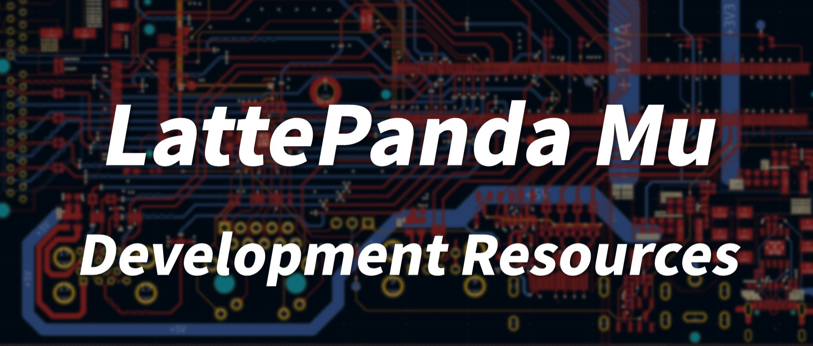

# LattePanda Mu Carrier Development Resources

Welcome to the repository of development resources for the LattePanda Mu. With its extensive array of interfaces, you can craft your very own carrier board. While we have provided several reference designs to spark your creativity, a myriad of exciting possibilities awaits your discovery. This repository will be continuously updated to support the development of your personalized carrier board solutions.

- [**LattePanda Website**](https://www.lattepanda.com/)

- [**Join our Discord**](https://discord.gg/k6YPYQgmHt)

## Resource Directory

- **Electricals**: This includes pin descriptions, symbols and footprint libraries, project templates, and example projects.

- **Mechanicals**: This section provides dimensional drawings and 3D models of the LattePanda Mu, its heatsink, and other accessories.

- **Software**: BIOS, firmware, drivers, and other related software resources.
